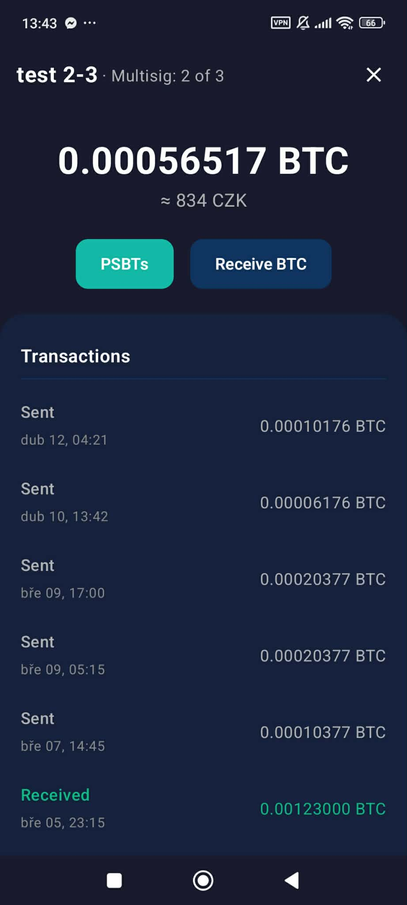
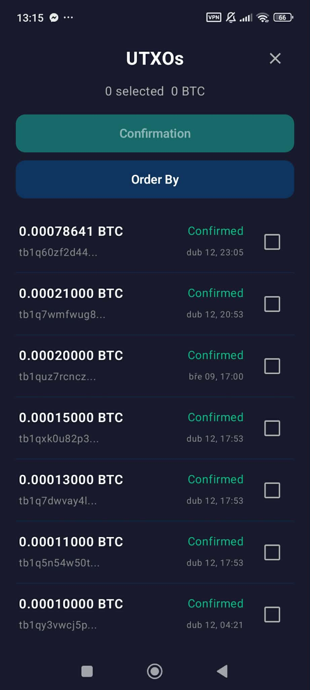
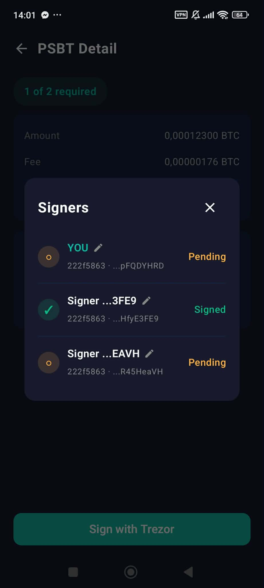
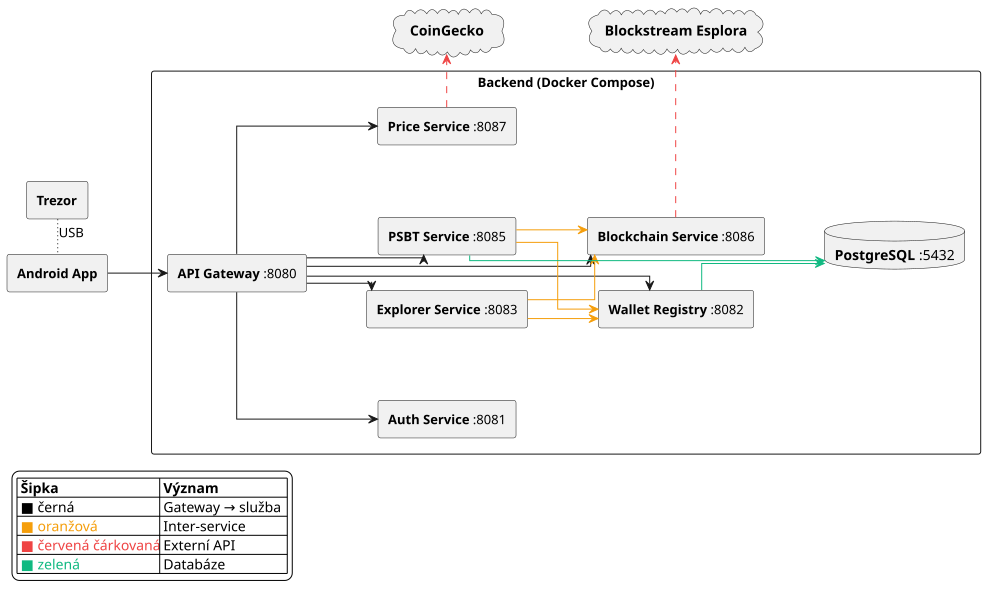
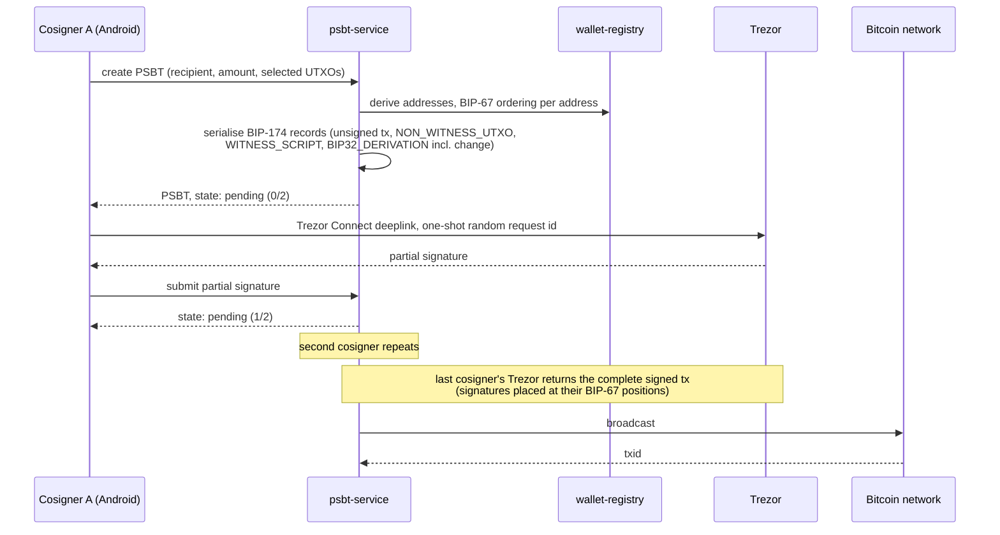

# Bitcoin Multisig Wallet for Advanced Users

[](https://github.com/Majny/bitcoin-multisig-wallet/actions/workflows/test.yml)

**Android wallet for M-of-N multisig Bitcoin custody with Trezor hardware signing, coin control,
and PSBT coordination between cosigners.** Bachelor's thesis, Faculty of Mathematics and Physics,
Charles University (MFF UK), defended June 2026 with grade *Excellent* and nominated by the
supervisor for a special award.

**Thesis (100 pp, Czech):** [dspace.cuni.cz/handle/20.500.11956/210821](https://dspace.cuni.cz/handle/20.500.11956/210821)
· **Author:** Jakub Dvořák · **Supervisor:** RNDr. Filip Zavoral, Ph.D.

> The design documents and the thesis are in Czech; this README is the English summary.

---

## What it is, and why it is harder than it looks

The whole system is built around one constraint: **the backend coordinates the cosigners but never
holds key material and never signs anything.** Every signature is made on the hardware wallet.

That constraint is what makes the project non-trivial. Because signing happens on a Trezor over the
Trezor Connect deeplink API, the backend cannot hand a signing library a transaction and take back a
signature. It has to do the work that library would normally do: build the
[BIP-174](https://github.com/bitcoin/bips/blob/master/bip-0174.mediawiki) PSBT binary structure
record by record, translate it into Trezor Connect parameters, route the partially-signed result to
the next cosigner, and place each cosigner's signatures at the positions
[BIP-67](https://github.com/bitcoin/bips/blob/master/bip-0067.mediawiki) requires, so that the last
cosigner's Trezor can output the complete signed transaction. All of that has to survive a mobile OS
that can kill the app mid-signing and a callback channel any other app on the device can invoke.

Every one of those is a place where being subtly wrong looks exactly like being right until real
money moves. Most of the engineering below exists to tell the difference.

## Screenshots

| Multisig wallet | Coin control | Cosigner status |
|---|---|---|
|  |  |  |

More screens in [`DOCS/thesis/img/`](DOCS/thesis/img/): dashboard, send, receive, PSBT detail,
broadcast, import, transaction detail, settings.

## Why it exists

Comparison of existing wallets against the target feature set (thesis §1.5):

| Wallet | Desktop | Mobile | Multisig | Coin control | Hardware wallet | Licence |
|---|---|---|---|---|---|---|
| Trezor Suite | yes | yes\* | **no** | yes | Trezor | source-available (T-RSL) |
| Sparrow | yes | **no** | yes | yes | multiple | Apache 2.0 |
| Liana | yes | **no** | partial† | **no** | other | MIT |
| BlueWallet | **no** | yes | yes | yes | QR/PSBT only | MIT |
| Nunchuk | yes | yes | yes | yes | multiple | proprietary‡ |
| Electrum | yes | yes\* | yes\* | yes\* | multiple | MIT |
| Wasabi | yes | **no** | **no** | yes | **no** | MIT |
| **This project** | no | **yes** | **yes** | **yes** | **Trezor** | MIT |

\* Mobile version with reduced functionality. † Miniscript policies instead of traditional M-of-N.
‡ Advanced features require a paid subscription.

No existing solution combines native multisig management, coin control, and direct Trezor Connect
integration on Android. Sparrow, the reference for multisig UX, has no mobile version at all.

## Architecture



Seven Kotlin/Ktor microservices, each with its own Dockerfile, behind a single gateway:

| Service | Port | Responsibility |
|---|---|---|
| `api-gateway` | 8080 | Entry point, JWT verification, routing |
| `auth-service` | 8081 | RS256 JWT issuance, device registry, refresh tokens |
| `wallet-registry` | 8082 | Wallet and address management, descriptor parsing, BIP-32/48/67 derivation |
| `explorer-service` | 8083 | Balances, transaction history, UTXO sets |
| `psbt-service` | 8085 | PSBT construction, serialisation, cosigner coordination, broadcast |
| `blockchain-service` | 8086 | Proxy to Blockstream / Mempool APIs, mainnet/testnet switching |
| `price-service` | 8087 | BTC price via CoinGecko |
| `postgres` | 5432 | PostgreSQL 16 |

Frontend is a native Android app in Jetpack Compose (MVVM). Full architecture document:
[`DOCS/05-architecture/architecture.md`](DOCS/05-architecture/architecture.md): services, data
model, inter-service contracts, all use-case data flows, and the Trezor Connect deeplink payload
structures.

### Multisig signing flow



## Security model: the deeplink threat model

Trezor Connect on Android works over a URL-scheme deeplink to Trezor Suite Mobile. The threat model
below covers four ways the deeplink round trip can go wrong on Android, and each mitigation is
implemented in the app (thesis §3.7.8).

1. **Callback spoofing.** Any app on the device can register the same URL scheme and invoke the
   callback; Android gives the receiver no way to distinguish an authentic Trezor Suite Mobile
   callback from a forged one. Stale intents can also be redelivered after process death.
   *Mitigation:* a 32-hex-character token from `SecureRandom` (16 bytes) held in
   `SessionStore.pendingRequestId`, echoed back as `?id`, compared in `TrezorCallbackActivity`, and
   deleted after a single use.
2. **Signatures from the wrong device.** *Mitigation:* defensive comparison of the master
   fingerprint against the one bound to the login session, plus reactive classification of the
   firmware's "forbidden key path" and "invalid public key" errors. Both collapse to a
   `WRONG_DEVICE` sentinel that forces a logout.
3. **BIP-39 passphrase identity.** Deliberately folded into (2): a different passphrase identity on
   the same Trezor is a different wallet, and for security purposes the two cases are
   indistinguishable, so both must be rejected.
4. **Process death mid-signing.** *Mitigation:* the login context (tokens, device fingerprint,
   active wallet) is persisted by `SessionPersistence` over SharedPreferences, so a cold-started
   process still knows who is signed in. The pending request id is not persisted: a callback that
   reaches a cold-started process has nothing to match, is rejected, and the user signs again. The
   channel fails closed instead of trusting a callback it cannot verify.

## Three bugs my own tests could not catch

Each of these passed every unit test I had, because every test I had was mocked.

**BIP-67 witness ordering.** I sorted the cosigner public keys once, globally, when building the
wallet. BIP-67 requires the sort to happen **per derived address**, over the child keys at that
index. The global order happens to coincide with the local order at the first address, so
single-address testing passed and the network rejected the first multi-input 2-of-3 as invalid.
Regression guard:
[`TrezorParamsBuilderTest.kt`: *build for multisig wallet places signer path on input and BIP-67 sorts pubkeys*](wallet-backend/psbt-service/src/test/kotlin/builder/TrezorParamsBuilderTest.kt),
which derives each cosigner's child key at address index 5 independently and checks the sorted order.

**Missing `PSBT_IN_NON_WITNESS_UTXO`.** Trezor firmware ≥ 2.3.1 refuses to sign a segwit input
without the full previous transaction. This is not a Trezor bug: it is a deliberate mitigation of
Saleem Rashid's BIP-143 fee attack, where a lying witness-UTXO amount tricks the device into
authorising an arbitrarily large fee. Regression guard:
[`PsbtBuilderRoundtripTest.kt`](wallet-backend/psbt-service/src/test/kotlin/builder/PsbtBuilderRoundtripTest.kt).

**Missing `PSBT_OUT_BIP32_DERIVATION` on the change output.** Without the derivation path on change,
the Trezor cannot prove the change address is ours and shows it as a second outgoing payment to a
foreign address, so the user is asked to approve what looks like a payment to a stranger but is
really their own change. Regression guard:
[`PsbtBuilderRoundtripTest.kt`](wallet-backend/psbt-service/src/test/kotlin/builder/PsbtBuilderRoundtripTest.kt).

The thesis documents five fixed bugs in §4.5; these three are the ones with named regression guards.

## Tests

```bash
cd wallet-backend && ./gradlew test
```

116 test methods across 12 classes in 5 backend modules (JUnit reports 140: four are parameterised
over 28 cases), run by GitHub Actions on every push to master. The suite is offline and
deterministic; `RefreshStoreTest`, `DeviceRepositoryTest` and `PsbtRepositoryTest` use in-memory H2
in PostgreSQL mode.

| Test class | Invariant it pins |
|---|---|
| [`PsbtBuilderRoundtripTest`](wallet-backend/psbt-service/src/test/kotlin/builder/PsbtBuilderRoundtripTest.kt) | Every generated PSBT reparses, and carries the records Trezor firmware requires |
| [`PsbtEncodingTest`](wallet-backend/psbt-service/src/test/kotlin/builder/PsbtEncodingTest.kt) | Binary BIP-174 record encoding; bech32 against BIP-173 vectors |
| [`PsbtBuilderTest`](wallet-backend/psbt-service/src/test/kotlin/builder/PsbtBuilderTest.kt) | Transaction vsize and fee estimation against the BIP-141 formula, singlesig and M-of-N |
| [`TrezorParamsBuilderTest`](wallet-backend/psbt-service/src/test/kotlin/builder/TrezorParamsBuilderTest.kt) | PSBT → Trezor Connect parameter translation; BIP-32 vectors |
| [`PsbtRepositoryTest`](wallet-backend/psbt-service/src/test/kotlin/db/PsbtRepositoryTest.kt) | PSBT state machine and signature accumulation |
| [`AddressDerivationTest`](wallet-backend/wallet-registry/src/test/kotlin/AddressDerivationTest.kt) | BIP-32/48/84 derivation and BIP-67 ordering; BIP-84 vectors |
| [`DescriptorParserTest`](wallet-backend/wallet-registry/src/test/kotlin/importer/DescriptorParserTest.kt) | Output-descriptor parsing for multisig import |
| [`JwtIssuerTest`](wallet-backend/auth-service/src/test/kotlin/JwtIssuerTest.kt) | RS256 issuance, claims, expiry |
| [`RefreshStoreTest`](wallet-backend/auth-service/src/test/kotlin/RefreshStoreTest.kt) | Refresh-token rotation and revocation |
| [`DeviceRepositoryTest`](wallet-backend/auth-service/src/test/kotlin/DeviceRepositoryTest.kt) | Device registration and master-fingerprint binding |
| [`MempoolClientTest`](wallet-backend/blockchain-service/src/test/kotlin/client/MempoolClientTest.kt) | Mempool/Blockstream response parsing, fee estimation |
| [`WalletExplorerTest`](wallet-backend/explorer-service/src/test/kotlin/service/WalletExplorerTest.kt) | Balance and UTXO aggregation |

**Pinned to published specification vectors:** BIP-32 (`TrezorParamsBuilderTest`), BIP-84
(`AddressDerivationTest`), BIP-173 bech32 (`PsbtEncodingTest`). Passing these means the derivation
and encoding agree with the reference implementations; a chance match on a 42-character address is
not a realistic failure mode. The wallet independently derives the same address set as Sparrow for
the same descriptor.

Testing is concentrated on the backend, where the consensus-critical logic lives; the Compose layer
is exercised manually and against testnet.

**End-to-end:** verified on Bitcoin testnet with a complete 2-of-3 multisig transaction:
import, address derivation, coin control, PSBT creation, two hardware signatures, broadcast,
confirmation. Mainnet was deliberately not tested (thesis §4.6).

## Design documents

All in Czech, under [`DOCS/`](DOCS/):

- [`01-overview.md`](DOCS/01-overview.md): application overview
- [`02-user-stories/`](DOCS/02-user-stories/): 16 user stories
- [`03-requirements/`](DOCS/03-requirements/): functional and non-functional requirements
- [`04-use-cases/`](DOCS/04-use-cases/): 14 use cases, each with a PlantUML sequence diagram
- [`05-architecture/architecture.md`](DOCS/05-architecture/architecture.md): full architecture
- [`thesis/`](DOCS/thesis/): LaTeX source, 22 diagrams, screenshots

---

## Setup

### 1. Backend

```bash
cd wallet-backend
docker compose up --build
```

API Gateway listens on port `8080`.

### 2. Frontend: set the backend host

The examples below use `<HOST_IP>` as a placeholder for the backend host. Substitute your own:

| Where Android runs | `<HOST_IP>` |
|---|---|
| Emulator on the same machine as Docker | `10.0.2.2` |
| Real device on the same LAN | LAN IP of the Docker host (e.g. `192.168.0.100`) |
| Real device over Tailscale / VPN | Tailnet IP of the Docker host (e.g. `100.64.0.10`) |

Put that IP in **two** places:

**a)** `wallet-frontend/local.properties` (Android Studio creates the file on first project open).
Add one line at the bottom:

```properties
api.gateway.base.url=http://<HOST_IP>:8080/api/v1
```

**b)** `wallet-frontend/app/src/main/res/xml/network_security_config.xml`: replace the `<domain>`
with the same IP (Android blocks cleartext HTTP to anything not whitelisted here):

```xml
<domain includeSubdomains="true"><HOST_IP></domain>
```

Then in Android Studio: **File → Sync Project with Gradle Files**, then **Run**.

### Requirements

- **Backend:** Docker Engine + Docker Compose
- **Frontend:** Android Studio, Android SDK (min API 24, target 34)
- **Hardware wallet:** Trezor Safe 3 / 5 / 7 with current firmware, plus Trezor Suite Mobile
  installed on the Android device

## Project layout

| Directory | Description |
|---|---|
| `wallet-frontend/` | Android app (Kotlin, Jetpack Compose) |
| `wallet-backend/` | Microservices (Kotlin/Ktor, PostgreSQL, Docker Compose) |
| `DOCS/` | Requirements, use cases, architecture, thesis source |

## Licence

MIT, see [`LICENSE`](LICENSE).

---

*Jakub Dvořák · [kubadvorak.com](https://kubadvorak.com) · hi@kubadvorak.com*
